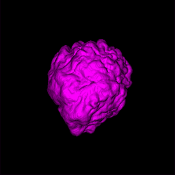

### EM Organelle Segmentation Pipeline



#### Requirements
An Nvidia GPU with at least 16GB RAM and drivers installed.  
Docker version 19+

#### Setup
We have tested on systems available at the Francis Crick Institute and
on AWS EC2 GPU instances. For example on AWS, p3.2xlarge with the Ubuntu
deep learning base AMI should run without issues.

###### Predict on new data
```
git clone https://github.com/FrancisCrickInstitute/Etch-a-Cell-Nuclear-Envelope.git 
cd Etch-a-Cell-Nuclear-Envelope  
```

Now place any EM image stacks you would like predictions for inside the folder
(relative to this readme file) projects/nuclear/resources/images/raw-stacks
```
./run_pipeline_predict.sh  
```

###### Rerun training
```
git clone https://github.com/FrancisCrickInstitute/Etch-a-Cell-Nuclear-Envelope.git
cd Etch-a-Cell-Nuclear-Envelope  
./run_pipeline_train.sh 
```


###### What resources are required to train a new model from scratch?
A csv output file from the Zooniverse platform, as well as the em image
stacks which are referenced by that csv. Both of these will be automatically
downloaded by the above shell scripts.


#### Overview
This program trains a machine learning model to segment organelles in
an electron microscope image. It learns to do this using citizen science
data obtained on the Zooniverse platform: https://www.zooniverse.org/.

#### Data collection
Large image stacks containing many cells come off an electron microscope.
They are then cropped to smaller images containing approximately a single
cell with dimensions on the order of 2000x2000 pixels, ~300 slices deep.
Separate slices are uploaded to the Zooniverse system and members of the
general public draw on top of the image slice at the location they believe
the organelle to be. Once sufficient annotations have been collected inside
the Zooniverse system, they may be downloaded as a csv.

#### Pipeline 
The purpose of this pipeline code is to take the data collected in the Zooniverse
platform, and use it to train a machine learning model to segment an organelle. 
All steps involved in this process appear in the pipeline folder and are mentioned
below. But the general idea is that the electron microscope images and annotations
citizen scientists drew on top of them must be converted in to x/y training data
for the model. These x/y pairs are image stacks that can easily be loaded as
numerical arrays at training time.

Once the preprocessing steps are complete, there should exist correctly formatted
image stacks for both the reference images, and the labels. Training can then be
undertaken locally as part of the pipeline or separately in the cloud. On a TPU
one can expect the algorithm to start to converge within a day or so or training.

#### Approaches to aggregation
Among preprocessing steps, the most unique to the current situation is the need to
filter or average over the available citizen scientist annotations. For example
some annotations may be little more than graffiti, and others may just be very
poor attempts. We have seen that making the effort to aggregate raw annotations
before passing to the model significantly improves performance. While several
methods were developed, the following was found particularly effective. 

###### Contour Regression by Interior Averages (CRIA)
Stitch together line segments to produce closed loops. All annotations are then
simply added and normalised. The average number of annotations is used as a
threshold to define the edge of the average interiors. This edge is used to extract
a final contour which is based on the accumulated annotations.

#### Model
The U-Net (https://arxiv.org/abs/1505.04597) is generally regarded as a strong
choice for biomedical image segmentation. The model here adopts the general
U-Net architecture, with its convolutional layers and autoencoder-style
compression path. However the exact topology, layer types, and size of the
network have been chosen in accordance with what we have found to be effective
for the domain in question.

Blocks inside the network are similar to those in Inception. The model performance 
is very sensitive to the number of blocks included, and as mentioned above, this
quantity has been tuned. Also highly sensitive to adjustment is the input patch
size. Larger patch sizes tend to produce better results, having access to more
information and context. But they are also slower to train and, if too large, would
mean that certain image stacks are too small to be fed to the model.

